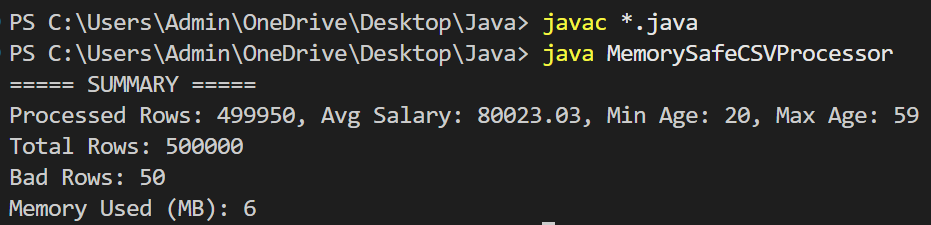

# Memory-Safe CSV Processor

A high-performance memory-efficient CSV processing engine built in Java using Streams API and custom Collectors.

The system processes large CSV datasets without loading the complete file into memory, making it scalable and efficient for handling large data files. It also safely handles malformed rows and generates useful statistical summaries.

---

## Features

- Processes 500K+ CSV records efficiently
- Memory-safe file streaming using `Files.lines()`
- Handles malformed CSV rows safely
- Custom Java Collector implementation
- Statistical aggregation:
  - Processed rows count
  - Average salary
  - Minimum age
  - Maximum age
- Fault-tolerant parsing using `Optional`
- SQL schema included for relational database practice

---

## Tech Stack

- Java
- Java Streams API
- Custom Collectors
- SQL
- File Streaming
- OOP Concepts

---

## Project Structure

```text
memory-safe-csv-processor/
│
├── src/
│   ├── MemorySafeCSVProcessor.java
│   ├── Summary.java
│   ├── EmployeeRecord.java
│
├── sample-output/
│   └── terminal-output.png
│
├── README.md
├── queries.sql
└── .gitignore
```

---

## Processing Flow

```text
CSV File
   ↓
Files.lines() Stream
   ↓
Safe Parser
   ↓
Optional<EmployeeRecord>
   ↓
Custom Collector
   ↓
Summary Statistics
```

---

## How It Works

### 1. CSV Generation

`CSVGenerator.java` generates a large CSV dataset with:
- Valid rows
- Intentionally malformed rows for testing

Example:

```csv
name,age,salary
User1,25,55000
BAD,ROW
User2,31,72000
```

---

### 2. Memory-Safe Streaming

The project uses:

```java
Files.lines(filePath)
```

instead of loading the complete file into memory.

This allows efficient processing of very large datasets.

---

### 3. Safe Parsing

Each row is parsed safely using:

```java
Optional<EmployeeRecord>
```

Malformed rows are skipped without crashing the application.

---

### 4. Custom Collector

A custom Collector is implemented to calculate:
- Total processed rows
- Average salary
- Minimum age
- Maximum age

without requiring multiple iterations over the dataset.

---

## Sample Output

```text
===== SUMMARY =====
Processed Rows: 499950, Avg Salary: 80023.03, Min Age: 20, Max Age: 59
Total Rows: 500000
Bad Rows: 50
Memory Used (MB): 6
```

---

## Execution Output




## SQL Practice

The project also includes relational database schema design in `queries.sql`.

Tables included:
- users
- products
- cart
- cart_items

Concepts covered:
- Primary Keys
- Foreign Keys
- Relationships
- Constraints

---

## Why This Project Matters

Most beginner projects load complete datasets into memory, which becomes inefficient for large files.

This project demonstrates:
- scalable backend engineering
- memory optimization
- functional programming using Streams
- fault-tolerant processing
- clean data aggregation techniques

---

## Future Improvements

- Parallel stream optimization
- Multi-threaded processing
- Export summary reports
- REST API integration
- Docker support
- Benchmark testing

---

## How to Run

### 1. Compile the files

```bash
javac *.java
```

### 2. Generate CSV dataset

```bash
java CSVGenerator
```

### 3. Run the processor

```bash
java MemorySafeCSVProcessor
```

---

## Author

Krishna Sharma
